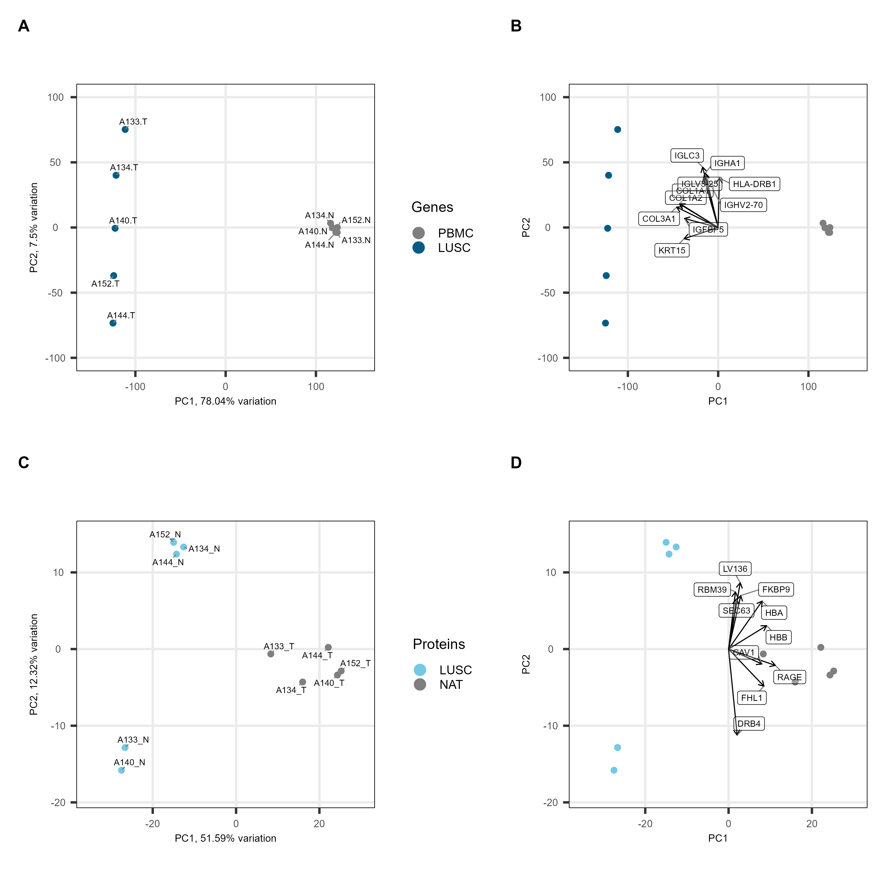
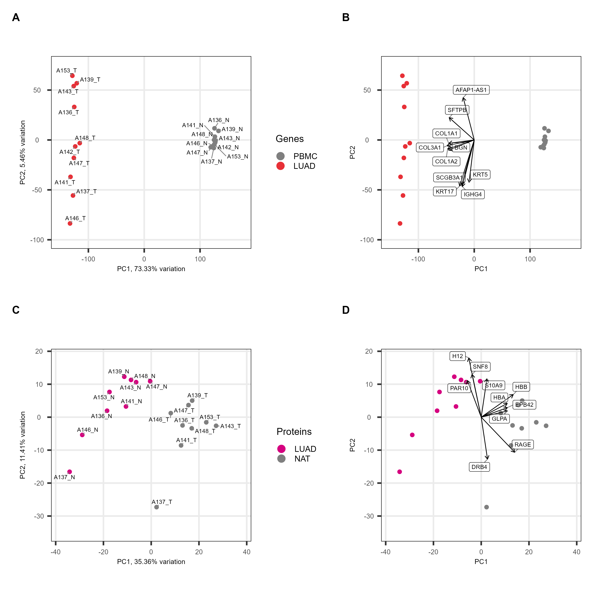
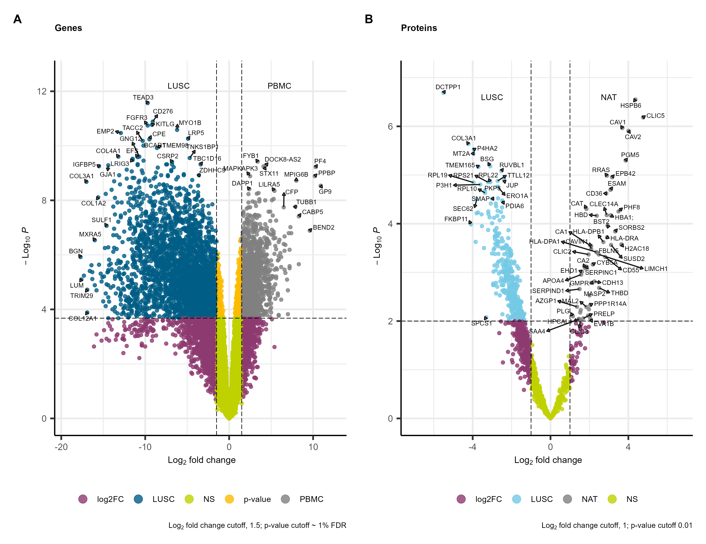
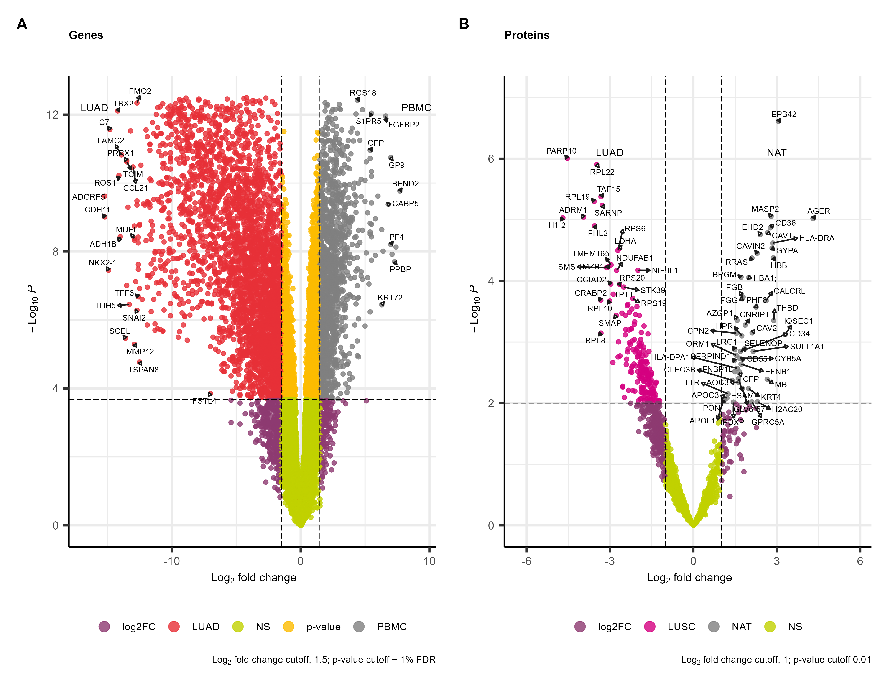
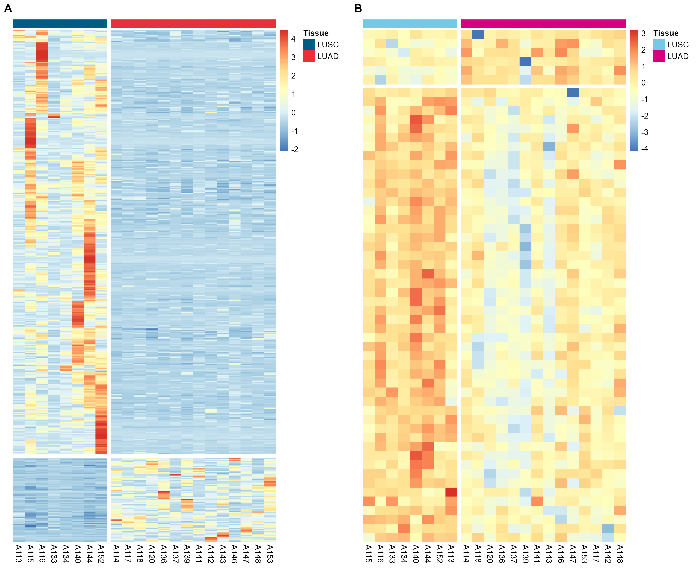
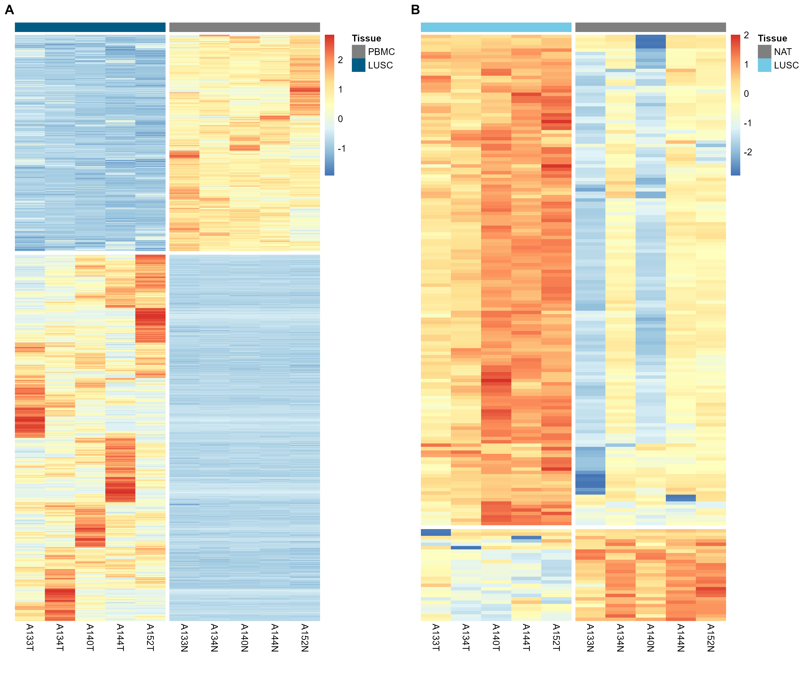
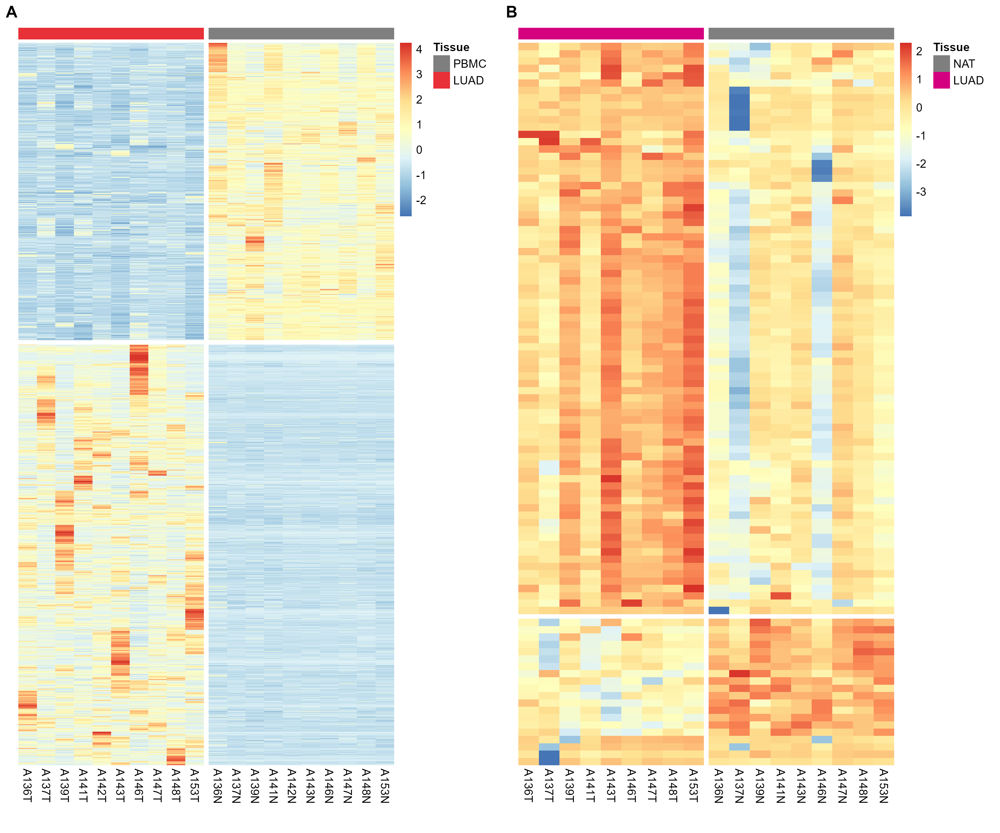
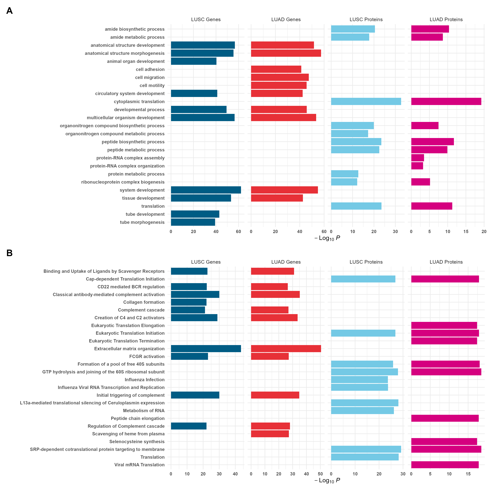

# Supplementary Information

Last Updated on 2024-12-05

 

This repository contains the supporting figures and tables for: 
**Comparative analysis of transcriptomic and proteomic expression between two non-small cell lung cancer subtypes**.

The supporting tables are `csv` files in the `tables` folder. The column names and contents of the `csv` files  
are described in Tables 1-6 below.

## Table of contents

### Supporting Figures

-   Figures S1 and S2: [PCA bi-plots of NSCLC subtypes PBMC and NAT comparisons](#pca-bi-plots-of-nsclc-subtypes-pbmc-and-nat-comparisons)
-   Figures S3 and S4: [Volcano plots of NSCLC subtypes PBMC and NAT comparisons.](#volcano-plots-of-nsclc-subtypes-pbmc-and-nat-comparisons)
-   Figures S5 to S7: [Heatmaps of NSCLC DEGs and DEPs.](#heatmaps-of-nsclc-degs-and-deps)
-   Figure S8: [Bar plots of functional enrichment between NSCLC subtypes and PBMC and NAT.](#functional-analysis-of-nsclc-subtypes-pbmc-and-nat-comparisons)

### Tables

-   [Gene counts from the HISAT2 alignments estimated by featureCounts.](#hisat2)
-   [Gene counts from transcript classification by Salmon.](#salmon)
-   [Differential gene expression edgeR outputs.](#differential-gene-expression-with-edger)
-   [Peaks normalised top 3 peptide intensities.](#peaks-normalised-top-3-peptide-intensities)
-   [Differential protein expression DEqMS outputs.](#differential-protein-expression-with-deqms)
-   [Functional enrichment analysis g:Profiler outputs.](#functional-analysis-with-gprofiler)

## PCA bi-plots of NSCLC subtypes PBMC and NAT comparisons

Figure S1: Bi-plots of the LUSC and PBMC and NAT comparison. **(A)** PCA
of normalised gene count matrix numbered with donor identifier. LUSC
(blue) & PBMC (grey). **(B)** PCA of normalised gene count matrix with
the genes contributing to the PC directions annotated. **(C)** PCA of
normalised top 3 peptide intensities numbered with donor identifier.
LUSC (light blue) & NAT (grey). **(D)** PCA of normalised top 3 peptide
intensities with the protein contributing to the PC directions
annotated.

Figure S2: Bi-plots of the LUAD and PBMC and NAT comparison. **(A)** PCA
of normalised gene count matrix numbered with donor identifier. LUAD
(red) & PBMC (grey). **(B)** PCA of normalised gene count matrix with
the genes contributing to the PC directions annotated. **(C)** PCA of
normalised top 3 peptide intensities numbered with donor identifier.
LUAD (purple) & NAT (grey). **(D)** PCA of normalised top 3 peptide
intensities with the protein contributing to the PC directions
annotated.

## Volcano plots of NSCLC subtypes PBMC and NAT comparisons

Figure S3: **(A)** Comparison of LUSC & PBMC (n=17,719). Thresholds are
represented by dotted lines at FDR of 1% and log2 fold change
of 1.5. **(B)** Comparison of LUSC & NAT (n=1,330). Thresholds are
represented by dotted lines at p-value of 1% and log2 fold
change of 1.

Figure S4: **(A)** Comparison of LUAD & PBMC (n=17,586). Thresholds are
represented by dotted lines at FDR of 1% and log2 fold change
of 1.5. **(B)** Comparison of LUAD & NAT (n=1,478). Thresholds are
represented by dotted lines at p-value of 1% and log2 fold
change of 1.

## Heatmaps of NSCLC DEGs and DEPs

Figure S5: **(A)** Comparison of LUSC & LUAD DEGs below a FDR of 1%.
(n=428). **(B)** Comparison of LUSC & LUAD DEPs below a p-value 1%
(n=139). Colour bar shows log2 fold change rescaled as
z-scores i.e. each unit from zero represents one standard deviation from
the row average value for each protein.

Figure S6: **(A)** Comparison of LUSC & PBMC DEGs below a FDR of 1%.
(n=8,089). **(B)** Comparison of LUSC & NAT DEPs below a p-value 1%
(n=379). Colour bar shows log2 fold change rescaled as
z-scores i.e. each unit from zero represents one standard deviation from
the row average value for each protein.

Figure S7: **(A)** Comparison of LUAD & PBMC DEGs below a FDR of 1%.
(n=10,058). **(B)** Comparison of LUAD & NAT DEPs below a p-value 1%
(n=234). Colour bar shows log2 fold change rescaled as
z-scores i.e. each unit from zero represents one standard deviation from
the row average value for each protein.

## Functional analysis of NSCLC subtypes PBMC and NAT comparisons

Figure S8: Bar plots of functional enrichment between NSCLC subtypes and
PBMC and NAT. Statistical significance level indicated by the
-log10 p-value on the x-axis. **(A)** GO biological processes
enriched in NSCLC subtypes. **(B)** Reactome pathways enriched in NSCLC
subtypes.

## Transcript quantification and gene counts

Transcripts were quantified by genomic alignments using HISAT2 (version
2.2.1) \[[1](#ref-kim2019)\] and featureCounts (version 2.0.6)
\[[2](#ref-liao2013)\], and by transcript classification using Salmon
(version 1.10.3) \[[3](#ref-srivastava2020)\].

### HISAT2

Tables S1-3 contain the gene counts from the HISAT2 alignments estimated
by featureCounts.

Table 1

                     File                                    
                   ──────────────────────────────────────────
                     Table-S1-Hisat-LUAD-vs-PBMC-counts.csv  
                     Table-S2-Hisat-LUSC-vs-PBMC-counts.csv  
                     Table-S3-Hisat-LUSC-vs-LUAD-counts.csv  
                   ──────────────────────────────────────────

Column names: File

| Column name | Description |
|----|----|
| `name` | Ensembl gene identifier |
| `gene` | HGNC gene symbol |
| `sample_id` the donor id or donor id suffixed with `T` for tumour or `N` for PBMC samples. | mapped read counts from featureCounts |

HISAT2 Counts Tables Information

### Salmon

Tables S4-6 contain the gene counts from transcript classification by
Salmon.

Table 2

                    File                                     
                  ───────────────────────────────────────────
                    Table-S4-Salmon-LUAD-vs-PBMC-counts.csv  
                    Table-S5-Salmon-LUSC-vs-PBMC-counts.csv  
                    Table-S6-Salmon-LUSC-vs-LUAD-counts.csv  
                  ───────────────────────────────────────────

Column names: File

| Column name | Description |
|----|----|
| `name` | Ensembl gene identifier |
| `gene` | HGNC gene symbol or Ensembl if missing |
| `length` | the length of the target transcript |
| `sample_id` the donor id or donor id suffixed with `T` for tumour or `N` for PBMC samples. | mapped reads counts by Salmon |

Salmon Counts Table Information

## Differential gene expression with EdgeR

Differential gene expression (DEG) was estimated using EdgeR and default
settings \[[4](#ref-edgeR)\]. Results were filtered for common DEG from
both HISAT2 and Salmon counts

Tables S7-9 contain the edgeR outputs.

Table 3

                      File                                 
                    ───────────────────────────────────────
                      Table-S7-edgeR-DEG-LUAD-vs-PBMC.csv  
                      Table-S8-edgeR-DEG-LUSC-vs-PBMC.csv  
                      Table-S9-edgeR-DEG-LUSC-vs-LUAD.csv  
                    ───────────────────────────────────────

Column names: File

| Column name | Description |
|----|----|
| `name` | Ensembl gene identifier |
| `gene` | HGNC gene symbol or Ensembl if missing |
| `baseMean` | mean read counts |
| `baseMeanA` | mean read count group A |
| `baseMeanB` | mean read count group B |
| `foldChange` | fold change B/A |
| `log2FoldChange` | log2 fold change B/A |
| `PValue` | p-value |
| `PAdj` | Benjamini-Hochbergadjusted p-value |
| `FDR` | False discovery rate |
| `falsePos` | false discovery counts |
| `sample_id` the donor id or donor id suffixed with `T` for tumour or `N` for PBMC samples. | sample HISAT2 read count |

edgeR Table information

## Peaks normalised Top 3 peptide intensities

Label free quantification using the Peaks Q module of Peaks Studio
\[[5](#ref-zhang2012),[6](#ref-lin2013)\] yielding matrices of protein
identifications as quantified by their normalised top 3 peptide
intensities.

Tables S10-12 contain normalised top 3 peptide intensities.

Table 4

           File                                                        
         ──────────────────────────────────────────────────────────────
           Table-S10-Peaks-top3-peptides-intensities-LUAD-vs-NAT.csv   
           Table-S11-Peaks-top3-peptides-intensities-LUSC-vs-NAT.csv   
           Table-S12-Peaks-top3-peptides-intensities-LUSC-vs-LUAD.csv  
         ──────────────────────────────────────────────────────────────

Column names: File

| Column name | Description |
|----|----|
| `protein` | protein short name |
| `gene` | HGNC gene symbol |
| `sample_id` the donor id or donor id suffixed with `T` for tumour or `N` for NAT samples | Normalised top 3 peptide intensity from Peaks |

Peaks normalised Top 3 peptide intensities Table information

## Differential protein expression with DEqMS

The normalised top 3 peptide intensities were filtered to remove any
proteins for which there were more than two missing values across the
samples. Differential protein expression (DEP) was then calculated with
DEqMS using the default steps \[[7](#ref-deqms)\].

Tables S13-15 contain the outputs of DEqMS.

Table 5

                      File                                  
                    ────────────────────────────────────────
                      Table-S13-DEqMS-DEP-LUAD-vs-NAT.csv   
                      Table-S14-DEqMS-DEP-LUSC-vs-NAT.csv   
                      Table-S15-DEqMS-DEP-LUSC-vs-LUAD.csv  
                    ────────────────────────────────────────

Column names: File

| Column name    | Description                                    |
|----------------|------------------------------------------------|
| `logFC`        | log2 fold change between two groups            |
| `AveExpr`      | the mean of the log2 ratios across all samples |
| `t`            | Limma t-values                                 |
| `P.Value`      | Limma p-values                                 |
| `adj.P.Val`    | BH method adjusted Limma p-values              |
| `B`            | Limma B values                                 |
| `gene`         | HGNC gene symbol                               |
| `count`        | peptide count values                           |
| `sca.t`        | DEqMS t-statistics                             |
| `sca.P.Value`  | DEqMS p-values                                 |
| `sca.adj.pval` | BH method adjusted DEqMS p-values              |
| `protein`      | protein short name                             |

DEqMS Table information

## Functional analysis with g:Profiler

Functional enrichment analysis used g:Profiler \[[8](#ref-kolberg2020)\]
using default settings for homo sapiens modified to exclude GO
electronic annotations. Gene ids were used as inputs for DEGs and
protein ids for DEPs.

Tables S16-23 contain the g:Profiler outputs.

Table 6

                    File                                      
                  ────────────────────────────────────────────
                    Table-S16-gprofiler-DEG-LUAD-vs-PBMC.csv  
                    Table-S17-gprofiler-DEG-LUSC-vs-PBMC.csv  
                    Table-S18-gprofiler-DEG-LUAD-vs-LUSC.csv  
                    Table-S19-gprofiler-DEG-LUSC-vs-LUAD.csv  
                    Table-S20-gprofiler-DEP-LUAD-vs-NAT.csv   
                    Table-S21-gprofiler-DEP-LUSC-vs-NAT.csv   
                    Table-S22-gprofiler-DEP-LUAD-vs-LUSC.csv  
                    Table-S23-gprofiler-DEP-LUSC-vs-LUAD.csv  
                  ────────────────────────────────────────────

Column names: File

<table>
<caption>g:Profiler Table information</caption>
<colgroup>
<col style="width: 15%" />
<col style="width: 84%" />
</colgroup>
<thead>
<tr class="header">
<th>Column name</th>
<th>Description</th>
</tr>
</thead>
<tbody>
<tr class="odd">
<td><code>query</code></td>
<td>the name of the input query</td>
</tr>
<tr class="even">
<td><code>significant</code></td>
<td>indicator for statistically significant results</td>
</tr>
<tr class="odd">
<td><code>p_value</code></td>
<td>hypergeometric p-value after correction for multiple testing</td>
</tr>
<tr class="even">
<td><code>term_size</code></td>
<td>number of genes that are annotated to the term</td>
</tr>
<tr class="odd">
<td><code>query_size</code></td>
<td>number of genes that were included in the query</td>
</tr>
<tr class="even">
<td><code>intersection_size</code></td>
<td>the number of genes in the input query that are annotated to the
corresponding term</td>
</tr>
<tr class="odd">
<td><code>precision</code></td>
<td>the proportion of genes in the input list that are annotated to the
function (defined as intersection_size/query_size)</td>
</tr>
<tr class="even">
<td><code>recall</code></td>
<td>the proportion of functionally annotated genes that the query
recovers (defined as intersection_size/term_size)</td>
</tr>
<tr class="odd">
<td><code>term_id</code></td>
<td>unique term identifier</td>
</tr>
<tr class="even">
<td>
<code>source</code>

<code>term_name</code>
</td>
<td>the abbreviation of the data source for the term (e.g. GO:BP)</td>
</tr>
<tr class="odd">
<td><code>effective_domain_size</code></td>
<td>the total number of genes “in the universe” used for the
hypergeometric test</td>
</tr>
<tr class="even">
<td><code>source_order</code></td>
<td>numeric order for the term within its data source</td>
</tr>
<tr class="odd">
<td><code>parents</code></td>
<td>list of term IDs that are hierarchically directly above the term.
For non-hierarchical data sources this points to an artificial root
node.</td>
</tr>
<tr class="even">
<td><code>evidence_codes</code></td>
<td>a lists of all evidence codes for the intersecting genes between
input and the term. The evidences are separated by comma for each
gene.</td>
</tr>
<tr class="odd">
<td><code>intersection</code></td>
<td>a comma separated list of genes from the query that are annotated to
the corresponding term</td>
</tr>
</tbody>
</table>

g:Profiler Table information

## References

1.
Kim D, Paggi JM, Park C, Bennett
C, Salzberg SL. Graph-based genome alignment and genotyping with HISAT2
and HISAT-genotype. Nature Biotechnology. 2019;37: 907–915.
doi:[10.1038/s41587-019-0201-4](https://doi.org/10.1038/s41587-019-0201-4)

2.
Liao Y, Smyth GK, Shi W.
featureCounts: an efficient general purpose program for assigning
sequence reads to genomic features. Bioinformatics. 2013;30: 923–930.
doi:[10.1093/bioinformatics/btt656](https://doi.org/10.1093/bioinformatics/btt656)

3.
Srivastava A, Malik L, Sarkar H,
Patro R. A Bayesian framework for inter-cellular information sharing
improves dscRNA-seq quantification. Bioinformatics. 2020;36: i292–i299.
doi:[10.1093/bioinformatics/btaa450](https://doi.org/10.1093/bioinformatics/btaa450)

4.
Yunshun Chen , Aaron Lun, Davis
McCarthy , Xiaobei Zhou , Mark Robinson, Gordon Smyth. edgeR. 2017.
doi:[10.18129/B9.BIOC.EDGER](https://doi.org/10.18129/B9.BIOC.EDGER)

5.
Zhang J, Xin L, Shan B, Chen W,
Xie M, Yuen D, et al. PEAKS DB: De novo sequencing assisted database
search for sensitive and accurate peptide identification. Molecular &
Cellular Proteomics. 2012;11: M111010587. 

6.
Lin H, He L, Ma B. A combinatorial
approach to the peptide feature matching problem for label-free
quantification. Bioinformatics. 2013;29: 1768–1775.
doi:[10.1093/bioinformatics/btt274](https://doi.org/10.1093/bioinformatics/btt274)

7.
DEqMS. Available:
<http://bioconductor.org/packages/DEqMS/>

8.
Kolberg L, Raudvere U, Kuzmin I,
Vilo J, Peterson H. gprofiler2 – an R package for gene list functional
enrichment analysis and namespace conversion toolset g:Profiler.
F1000Research. 2020;9: 709.
doi:[10.12688/f1000research.24956.2](https://doi.org/10.12688/f1000research.24956.2)

